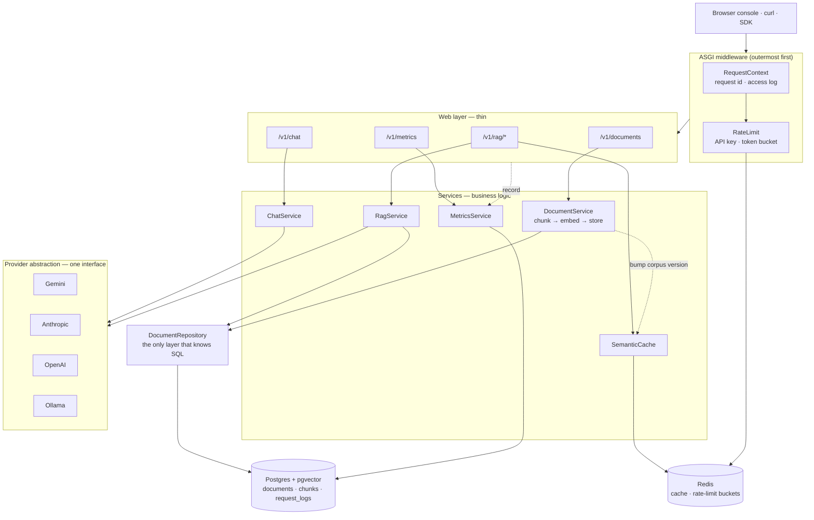

# docXpo

[](https://github.com/ayushjariyal/docXpo/actions/workflows/ci.yml)
[](LICENSE)

A self-hostable **LLM gateway and RAG service**: one API in front of four model
providers, with document retrieval, a semantic response cache, per-key rate
limiting, and cost/latency observability.

Built as a learning project in seven phases. Every non-obvious decision — and
the measurements behind it — is written up in **[DECISIONS.md](DECISIONS.md)**.

---

## Architecture



**Request flow is one-directional:** `routers → services → repositories/providers`.
The web layer never imports a vendor SDK, and only the repository writes SQL.

### How a RAG query flows

```
question
  → embed once  ──────────────┐  (one vector, two uses)
  → semantic cache lookup ────┤  hit? return stored answer, 0 tokens
  → pgvector top-k search ────┘
  → inject chunks as system context
  → stream tokens over SSE
  → store answer in cache · record tokens/cost/latency
```

---

## Quick start

```bash
cp .env.example .env
# edit .env: set GEMINI_API_KEY=...
docker compose up -d --build
```

Then open **<http://localhost:8000/>**.

**One API key is required** — for whichever provider `DEFAULT_PROVIDER` names.
There is no mock fallback: with a missing or rejected key the app fails at
startup rather than serving synthetic output.

| URL | What |
|---|---|
| <http://localhost:8000/> | Browser console (chat · docs · metrics) |
| <http://localhost:8000/docs> | OpenAPI / Swagger |
| <http://localhost:8000/health/ready> | Readiness (checks Postgres + Redis) |

Use `docker compose up -d --build` when **dependencies** change; plain
`up -d` otherwise (code hot-reloads).

---

## Providers

All four sit behind one `LLMProvider` interface, so switching is an env var
change with no code edit.

| `DEFAULT_PROVIDER` | Default model | Key | Notes |
|---|---|---|---|
| `gemini` *(default)* | `gemini-flash-latest` | `GEMINI_API_KEY` | Most generous free tier — [get a key](https://aistudio.google.com/apikey) |
| `anthropic` | `claude-sonnet-4-6` | `ANTHROPIC_API_KEY` | Paid credits required |
| `openai` | `gpt-4o-mini` | `OPENAI_API_KEY` | Paid credits required |
| `ollama` | `llama3.2` | *(none)* | Fully local; needs `ollama serve` |

Only the selected provider's key is needed. Override per request with
`{"provider": "anthropic", ...}`.

**Embeddings are configured separately** (`EMBEDDING_PROVIDER`) because
Anthropic has no embedding model — you can legitimately chat on one vendor and
embed on another.

---

## Features

### Streaming chat — `POST /v1/chat`

Server-Sent Events, token by token.

```bash
curl -N -X POST localhost:8000/v1/chat \
  -H 'content-type: application/json' \
  -d '{"messages":[{"role":"user","content":"What is RAG?"}]}'
```

```
event: token
data: {"text":"Retrieval"}

event: done
data: {"provider":"gemini","model":"gemini-3.6-flash",
       "usage":{"input_tokens":16,"output_tokens":62,"total_tokens":78},
       "finish_reason":"stop","latency_ms":842.13,"cached":false}

event: error
data: {"error":"...","type":"ProviderUnavailable","retryable":true}
```

`error` is **terminal**. It only appears for failures *after* streaming began;
anything failing before the first token is a normal HTTP error status.

### RAG — `POST /v1/documents`, `POST /v1/rag/query`

Upload **plain text or PDF**, and it is chunked (~1200 chars, 200 overlap, split on semantic
boundaries), embedded at 768 dimensions, and stored in pgvector with an HNSW
index. Queries retrieve top-k by cosine similarity and inject the chunks as
context, with `[1]`-style citations resolving to the returned `sources`.

PDFs are detected by **magic bytes**, not the client-supplied `Content-Type`,
and their text layer is extracted with `pypdf` (pure Python — no poppler in the
image). Anything unreadable is refused with a `415`/`422` and a message naming
what it thinks the file was, rather than being decoded into garbage and indexed.
Scanned/image-only PDFs are rejected explicitly: extracting those needs OCR.

`POST /v1/rag/retrieve` runs retrieval **without generating** — useful for
tuning `top_k` and chunk size, and it spends no generation quota.

### Semantic cache

A paraphrase of an earlier question returns the stored answer in ~1ms instead
of ~2500ms. Threshold defaults to **0.98**, calibrated from measurement —
see [DECISIONS.md](DECISIONS.md) for why a *negated* question scores 0.975 and
what that implies.

### Rate limiting — per API key

Redis token bucket (60 rpm sustained, 20 burst), enforced by an atomic Lua
script. Returns `429` with `Retry-After`, and `X-RateLimit-*` on every response
so clients can slow down before being rejected. `/health` is exempt.

Set `API_KEYS=key1,key2` to enforce; empty means open mode metered by IP.

### Observability — `GET /v1/metrics`

Per-request tokens, latency, TTFT, provider, cache-hit status and estimated
cost land in Postgres. `/v1/metrics` aggregates requests, cache-hit rate, spend,
spend *saved by the cache*, and p50/p95/p99.

---

## Tests

```bash
pytest                      # everything (integration auto-skips if services are down)
pytest -m "not integration" # unit only — no Docker needed
pytest tests/integration    # against real Postgres + Redis
```

Two tiers, deliberately:

| Tier | Count | Verifies | Speed |
|---|---|---|---|
| **Unit** | 119 | Our logic, with fakes. Runs anywhere. | ~15s |
| **Integration** | 23 | What we handed to the database | ~4s |

The integration tier exists because a fake can be wrong in the same way the
code is. It runs the **actual** pgvector `<=>` operator, the **actual** rate
limiter Lua script (including a 30-way concurrency test that proves atomicity),
and the **actual** `percentile_cont` aggregation. Every test runs inside a
transaction that is rolled back, so it leaves no residue.

Services down? The tier skips with a clear reason rather than failing.

---

## Local development

```bash
python -m venv .venv
.venv\Scripts\activate          # Windows;  source .venv/bin/activate on Unix
pip install -e ".[dev]"

docker compose up -d postgres redis
alembic upgrade head
uvicorn app.main:app --reload --no-access-log
```

### PowerShell note

Use `curl.exe`, not `curl` (an alias for `Invoke-WebRequest`). Put JSON bodies
in a **file** — inline JSON does not survive PowerShell's argument handling once
the content contains spaces:

```powershell
'{"messages":[{"role":"user","content":"What is RAG?"}]}' | Set-Content -Encoding ascii body.json
curl.exe -N -X POST localhost:8000/v1/chat -H "content-type: application/json" -d "@body.json"
```

---

## Layout

```
app/
  api/            web layer — routing, validation, HTTP only
    health.py       liveness + readiness (unversioned: infra, not API surface)
    ui.py           serves the browser console
    v1/routes/      chat · documents · rag · metrics
  core/           cross-cutting
    config.py       every knob, typed and validated at boot
    middleware.py   request id + access log (raw ASGI, streaming-safe)
    rate_limit.py   token bucket + Lua script
    auth.py         API-key identity (fingerprinted, never stored raw)
    pricing.py      cost estimation
  llm/            provider abstraction — one interface, four implementations
    base.py         LLMProvider ABC + normalized stream events
    embeddings.py   separate interface (Anthropic has no embedding model)
  services/       business logic — chunking, RAG, cache, metrics
  repositories/   data access — the only layer that knows SQL
  db/             engine, session, models
  web/            the single-file browser console
alembic/          migrations
tests/            unit tier
tests/integration/  real Postgres + Redis tier
```

---

## Useful commands

```bash
docker compose logs -f app
docker compose exec postgres psql -U docxpo -d docxpo
alembic upgrade head
alembic downgrade -1
ruff check .
curl localhost:8000/v1/metrics?window_hours=24
curl -X DELETE localhost:8000/v1/rag/cache
```
